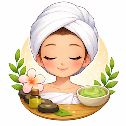

<p align="center">
  
</p>

# Spa Day

[](https://github.com/remarkablegames/spa-day/actions/workflows/build.yml)

🫧 <kbd>Spa Day</kbd> was made for Global Game Jam 2026, which the theme was **mask**.

Play the game on:

- [remarkablegames](https://remarkablegames.org/spa-day/)

## Prerequisites

[nvm](https://github.com/nvm-sh/nvm#installing-and-updating):

```sh
brew install nvm
```

## Install

Clone the repository:

```sh
git clone https://github.com/remarkablegames/spa-day.git
cd spa-day
```

Install the dependencies:

```sh
npm install
```

Update the files:

- [ ] `public/app-icon.png`
- [ ] `public/favicon.png`

## Environment Variables

Update the environment variables:

```sh
cp .env .env.local
```

Update the **Secrets** in the repository **Settings**.

## Available Scripts

In the project directory, you can run:

### `npm start`

Runs the game in the development mode.

Open [http://localhost:5173](http://localhost:5173) to view it in the browser.

The page will reload if you make edits.

You will also see any errors in the console.

### `npm run build`

Builds the game for production to the `dist` folder.

It correctly bundles in production mode and optimizes the build for the best performance.

The build is minified and the filenames include the hashes.

Your game is ready to be deployed!

### `npm run bundle`

Builds the game and compresses the contents into a ZIP archive in the `dist` folder.

Your game can be uploaded to your server, [itch.io](https://itch.io/), [newgrounds](https://www.newgrounds.com/), etc.

## License

[MIT](LICENSE)
